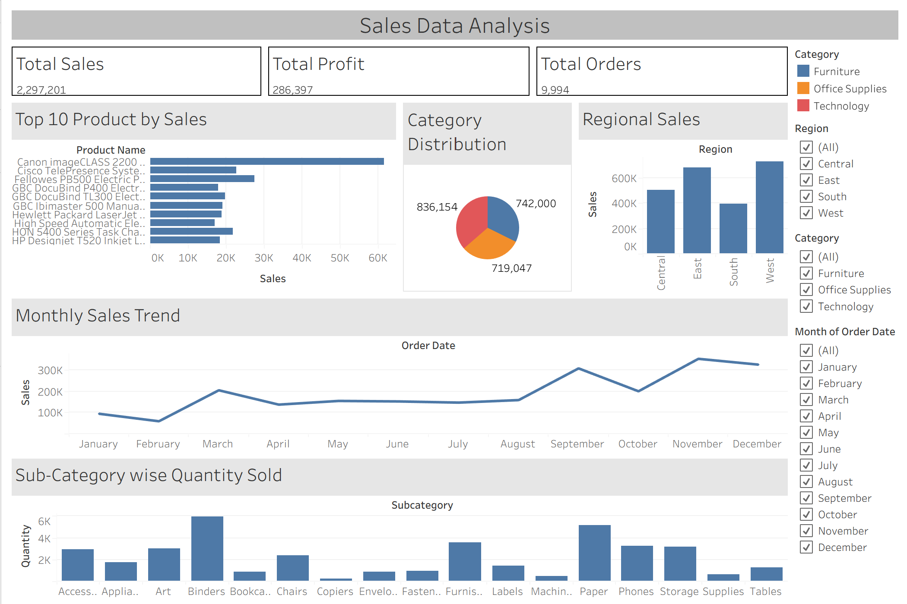

# 📊 Sales Dashboard Analysis

## 📌 Project Overview

This project presents an interactive Sales Dashboard developed using **Python** and **Tableau Public**. The dataset was analyzed to identify sales trends, product performance, and category-wise distribution, helping generate meaningful business insights through visualizations.

---

## 🎯 Objectives

- Analyze overall sales performance.
- Identify top-performing products.
- Visualize monthly sales trends.
- Compare sales across different categories.
- Build an interactive dashboard for better decision-making.

---

## 🛠️ Tools & Technologies

- Python
- Pandas
- NumPy
- Jupyter Notebook
- Tableau Public

---

## 📂 Dataset

The project uses a sales dataset containing information such as:

- Order Date
- Product Name
- Category
- Sales
- Quantity
- Profit
- Region

---

## 📈 Dashboard Features

- 💰 Total Sales KPI
- 📅 Monthly Sales Trend
- 📦 Category-wise Sales Distribution
- 🏆 Top 10 Products by Sales
- 📊 Interactive Dashboard

---

## 📁 Repository Structure

```
Sales-Dashboard-Analysis/
│
├── README.md
├── SalesDataAnalysis.ipynb
├── Sales_data.csv
├── Sales Data Analysis.twbx
└── dashboard.png
```

---

## 🚀 How to Run the Project

1. Clone this repository.

```
git clone https://github.com/yourusername/sales-dashboard-analysis.git
```

2. Open **SalesDataAnalysis.ipynb** in Jupyter Notebook.

3. Install the required Python libraries if needed.

```
pip install pandas numpy matplotlib
```

4. Open **Sales Data Analysis.twbx** using Tableau Public Desktop.

---

## 📊 Dashboard Preview



---

## 📌 Key Insights

- Identified the best-performing product categories.
- Visualized monthly sales performance.
- Ranked the Top 10 products based on sales.
- Built an interactive dashboard for business analysis.

---

## 📚 Skills Demonstrated

- Data Cleaning
- Exploratory Data Analysis (EDA)
- Data Visualization
- Business Intelligence
- Dashboard Design
- Tableau
- Python
- Pandas

---

## 👤 Author

**Bhavya Tagadia**

Bachelor of Engineering (Information Technology)

GitHub: https://github.com/bhavyat-23

---

## ⭐ If you found this project useful, consider giving it a star!
